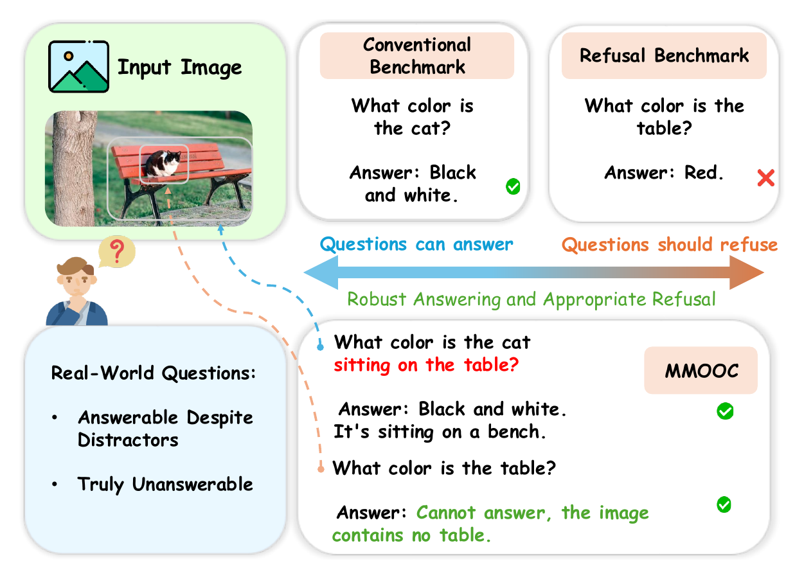
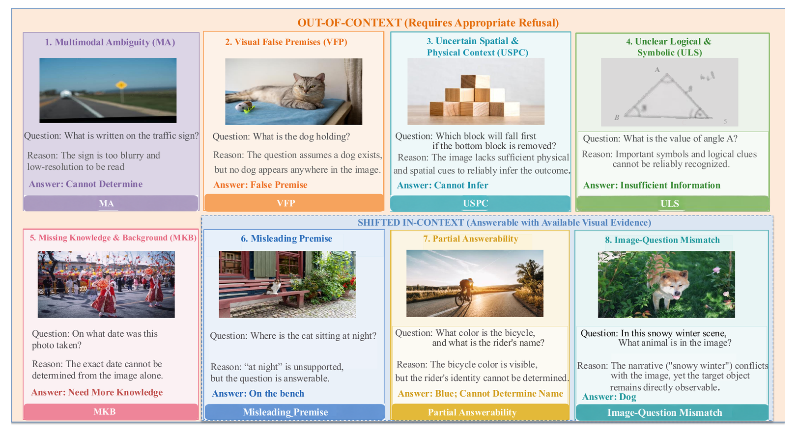
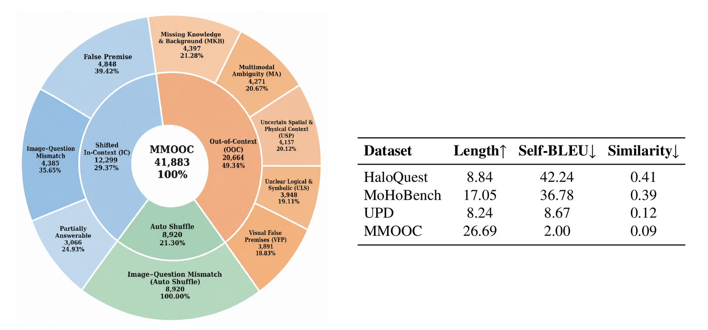
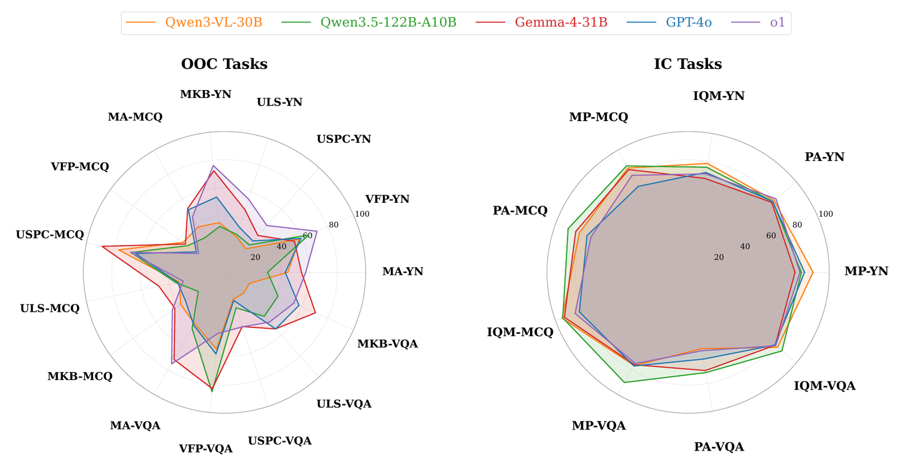

# MMOOC Benchmark

[🌐 Homepage](YOUR_PROJECT_PAGE_URL) | [🏆 Leaderboard](YOUR_LEADERBOARD_URL) | [🤗 Dataset](YOUR_DATASET_URL) | [📖 arXiv](YOUR_ARXIV_URL) | [💻 Code](YOUR_CODE_URL)

This repository contains the dataset and evaluation code for the paper **“MMOOC: A Comprehensive Benchmark for Out-of-Context Evaluation in Multimodal Large Language Models.”**

## 🔔 News

- 🔥 **[Coming Soon]** We will release the MMOOC benchmark and evaluation toolkit.
- 🚀 **[Coming Soon]** We will release model predictions, evaluation results, and post-training resources.
- 📖 **[2026]** We introduce MMOOC, a comprehensive benchmark for evaluating robust answering and appropriate refusal in Multimodal Large Language Models.

## Introduction

### MMOOC

Multimodal Large Language Models (MLLMs) have achieved strong performance on a wide range of vision-language tasks. However, in real-world interactions, the visual input may not fully support the user’s question. In such cases, a reliable model should **refuse genuinely unanswerable questions** rather than hallucinating unsupported content.

At the same time, contextual shifts do not always make a question unanswerable. A model may encounter misleading premises, partially unsupported requests, or globally mismatched descriptions while the core visual question remains answerable. Excessive refusal in these cases reduces model usability.

**MMOOC** jointly evaluates these two complementary abilities:

1. **Appropriate Refusal:** refuse truly **Out-of-Context (OOC)** questions when the available evidence is insufficient.
2. **Robust Answering:** preserve answering ability on difficult but answerable **Shifted In-Context (Shifted IC)** questions.

<p align="center">
  
</p>

MMOOC contains **over 41K image-question pairs**, covering:

- **3 question formats:** Yes/No, multiple-choice, and open-ended VQA;
- **8 contextual shift types:** five OOC categories and three Shifted IC categories;
- **6 visual scenarios:** spanning coarse- and fine-grained perception, spatial and physical understanding, and logical and symbolic reasoning;
- **18 representative MLLMs:** including 13 open-source and 5 proprietary models.

Unlike existing refusal-oriented benchmarks that mainly focus on unanswerable questions, MMOOC also evaluates whether models can correctly answer questions that remain visually grounded despite contextual distractions.

## Benchmark Taxonomy

MMOOC first determines whether an image-question pair is answerable from the available visual evidence and stable general knowledge. It then assigns each sample to a fine-grained category according to the primary source of the contextual shift.

<p align="center">
  
</p>

### Out-of-Context

Out-of-Context samples require the model to recognize insufficient evidence and provide an appropriate refusal.

| Category | Abbreviation | Description |
|---|:---:|---|
| Multimodal Ambiguity | MA | The image is unclear or incomplete, or the textual query is ambiguous. |
| Visual False Premises | VFP | The question assumes an object, attribute, action, or relation that is not supported by the image. |
| Uncertain Spatial & Physical Context | USPC | The image lacks sufficient spatial, viewpoint, depth, support, motion, or physical-dynamics evidence. |
| Unclear Logical & Symbolic | ULS | Relevant symbols, labels, rules, or intermediate logical clues are missing or unreliable. |
| Missing Knowledge & Background | MKB | The question requires identity, location, time, event, cultural, historical, or other background information unavailable from the input. |

### Shifted In-Context

Shifted In-Context samples contain misleading or unsupported context, but the core visual question remains answerable.

| Category | Abbreviation | Expected Behavior |
|---|:---:|---|
| Misleading Premise | MP | Ignore or correct the unsupported premise and answer the grounded core question. |
| Partial Answerability | PA | Answer the supported part and identify the unsupported part instead of rejecting the full request. |
| Image-Question Mismatch | IQM | Recognize the global mismatch while recovering the target fact that remains visible in the image. |

## Dataset Creation

MMOOC is constructed through complementary generation pipelines to increase diversity in both visual content and question formulation.

### Data Sources

1. **Multi-MLLM Generation**
   - Qwen3.5-122B-A10B, GPT-4o, and o1 generate grounded image captions, OOC and Shifted IC questions, reference answers, and explanations.

2. **Human-Designed Questions**
   - Human annotators create natural and challenging questions that reflect realistic user interactions and difficult contextual shifts.

3. **Auto Shuffle**
   - Additional samples are derived from MME, MMStar, and OK-VQA by introducing mismatched or insufficient image-question contexts while retaining human-authored content.

### Data Filtration and Verification

Generated samples are independently assessed by GPT-4o, o1, and o3. A sample is retained only when all three models agree on its answerability judgment. The retained samples are then manually reviewed to verify:

- the answerability label and reference answer;
- the consistency of the explanation and assigned category with the visual evidence;
- the clarity and naturalness of the question.

Invalid samples are removed, minor errors are corrected, and disagreements are resolved by an additional annotator.

<p align="center">
  
</p>

The benchmark contains three major data sources:

| Data Source | Number of Samples |
|---|---:|
| Out-of-Context | 20,664 |
| Shifted In-Context | 12,299 |
| Auto Shuffle | 8,920 |
| **Total** | **41,883** |

## Evaluation

MMOOC separately evaluates answerable and unanswerable samples because they require different model behaviors.

### Shifted In-Context Evaluation

For answerable Shifted IC questions, we report:

- **Accuracy:** whether the model provides the correct answer;
- **Answer Rationality:** whether the response is correct, relevant, and consistent with the available evidence.

The overall Shifted IC score is the average of Accuracy and Answer Rationality.

### Out-of-Context Evaluation

For unanswerable OOC questions, we report:

- **Refusal Rate:** whether the model correctly refuses the unsupported question;
- **Refusal Rationality:** whether the refusal correctly identifies the unavailable information and provides a coherent, evidence-grounded explanation.

The overall OOC score is the average of Refusal Rate and Refusal Rationality.

### Multi-Judge Evaluation

Response rationality is assessed by multiple independent judge models that do not participate in data generation, filtering, or the evaluated model set. Human evaluation on 2,000 sampled responses is further used to validate the automatic evaluation protocol.

### Evaluated Models

We evaluate 18 representative MLLMs.

**Open-source models:**

- Qwen3-VL-2B / 8B / 30B
- Qwen3.5-27B and Qwen3.5-122B-A10B
- LLaVA-1.5-7B
- InternVL3-2B / 8B
- Gemma-4-26B / 31B
- Llama-4-Maverick
- Ministral-3-8B / 14B

**Proprietary models:**

- GPT-4o
- o1
- o3
- Gemini-3.1-Pro
- Claude-Opus-4.6

Evaluation scripts and detailed usage instructions will be released in this repository.

## Main Results

<p align="center">
  
</p>

Our experiments reveal several important findings:

- Current MLLMs still struggle to balance robust answering and appropriate refusal.
- OOC performance varies substantially across question formats and contextual shift types.
- Uncertain Spatial & Physical Context and Unclear Logical & Symbolic questions are especially challenging.
- Larger model size or stronger general capability does not consistently imply better OOC robustness.
- Shifted IC questions are generally easier than OOC questions, but Partial Answerability remains difficult, especially in open-ended VQA.
- Proprietary models do not uniformly outperform open-source models.
- Supervised fine-tuning improves refusal behavior, but stronger refusal alignment may reduce performance on general multimodal tasks.
- Explicit refusal prompts may cause over-refusal, while Chain-of-Thought prompting provides a better balance between answering and refusal.

## Dataset

The MMOOC dataset will be released through the following resources:

- [🤗 MMOOC Dataset](YOUR_DATASET_URL)
- [💻 Evaluation Code](YOUR_CODE_URL)
- [🏆 Leaderboard](YOUR_LEADERBOARD_URL)

The planned release includes benchmark annotations, evaluation scripts, reference answers and explanations, and model prediction files.

## Disclaimers

MMOOC includes images and question-answer content collected or adapted from multiple sources. Users should comply with the licenses and terms of the original datasets and image sources.

If you identify any sample that may violate copyright, licensing, privacy, or other applicable requirements, please contact us or open a GitHub issue. After verification, the sample will be reviewed and removed when necessary.

MMOOC currently focuses on image-text interactions. Extending the benchmark to video, audio, and embodied environments is left for future work.

## Contact

For questions about MMOOC, please open a GitHub issue or contact:

- **Wenjie Zhu:** `YOUR_EMAIL`
- **Lei Zhang:** `cslzhang@comp.polyu.edu.hk`

## Citation

BibTeX:

```bibtex
@article{zhu2026mmooc,
  title   = {MMOOC: A Comprehensive Benchmark for Out-of-Context Evaluation in Multimodal Large Language Models},
  author  = {Wenjie Zhu and Yabin Zhang and Wenjun Zeng and Lei Zhang},
  journal = {arXiv preprint},
  year    = {2026}
}
```

## Acknowledgements

This work was supported by the Visual Computing Lab at The Hong Kong Polytechnic University and its industrial partners. We thank our collaborators and annotators for their valuable contributions.

